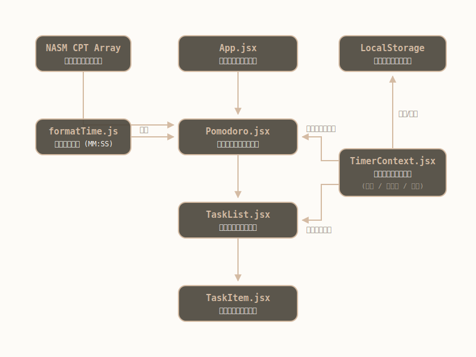

# Vibe Flow (Let's Stand & Task Pomo)

  

一款結合了「番茄鐘 (Pomodoro)」與「代辦事項 (To-Do List)」的極簡風辦公工具包。專為長時間久坐的辦公人士設計，強調簡約的清新美學，並且在番茄鐘休息時會隨機推送符合 **NASM CPT** 標準的伸展提示。

## 🌟 核心特色
- **極簡溫暖感介面**：融合低飽和色彩與平滑的微動畫，支援深淺色（Dark/Light Mode）主題無縫切換，帶來無壓力的操作體驗。
- **神準的「番茄鐘 x 代辦」計時連動**：追蹤特定任務時，一旦番茄鐘進入休息時間，任務的計時器會被「自動暫停」，讓統計數據嚴格排除休息時間。
- **水平置頂番茄鐘列 (Sticky Bar)**：重新設計的空間佈局，將番茄鐘功能固定於畫面上方，最大化任務清單的可視範圍，同時支援多組預設番茄鐘時間切換。
- **艾森豪矩陣 (Eisenhower Matrix) 雙視圖**：提供傳統「列表檢視」與「四象限矩陣檢視」，並具備智慧推算功能（例如到期日 3 天內自動判定為具備「緊急」屬性）。
- **NASM CPT 伸展提示**：進入休息時間時，自動隨機推送「坐姿梨狀肌伸展」、「胸大肌伸展」等遵循 NASM 規範的辦公室放鬆動作。

## 🚀 技術架構與開發過程

  

本專案經過深度重構，採用 **Vanilla JavaScript + HTML5 + CSS3** 的原生單一架構進行構建，完全捨棄了複雜的框架依賴與編譯環境。所有代碼、樣式及邏輯皆乾淨地拆分在 `index.html`、`app.js` 與 `app.css` 中。

### 開發疊代與架構亮點
1. **原生 JS (No Frameworks)**：運用模組化思維撰寫 Vanilla JS，透過精準的 DOM 操作與狀態管理，實現高效且無閃爍的畫面更新。
2. **現代化 UI 升級**：將原先區塊型的番茄鐘重構成佔用空間更小且能常駐頂部的水平控制列，有效擴張下方任務區域。針對響應式設計（RWD）做了全面適配，大幅最佳化各種裝置的體驗。
3. **智慧屬性推算**：在資料邏輯層加入智慧日期比對，不但能手動設定任務的「重要/緊急」標籤，系統也會自動檢查到期日，替三天內到期的任務增添「緊急」的動態屬性。
4. **無伺服器運行 (Zero Build Step)**：為了做到真正的「隨開即用」，專案無需 `npm install`。外部依賴（如 Lucide 圖示）皆採 CDN 引入形式，下載後直接點擊即可在瀏覽器完美運行。

## 🛠️ 如何執行
專案為完全靜態的網頁應用程式，您無需安裝任何編譯套件或 Node 環境：
- **方式一：** 使用 VS Code 的 **Live Server** 擴充套件，對 `index.html` 點擊 Go Live。
- **方式二：** 直接在您的瀏覽器中雙擊開啟 `index.html` 檔案。
- **方式三：** 將本資料夾部署至 GitHub Pages 等任何靜態網頁託管服務。
